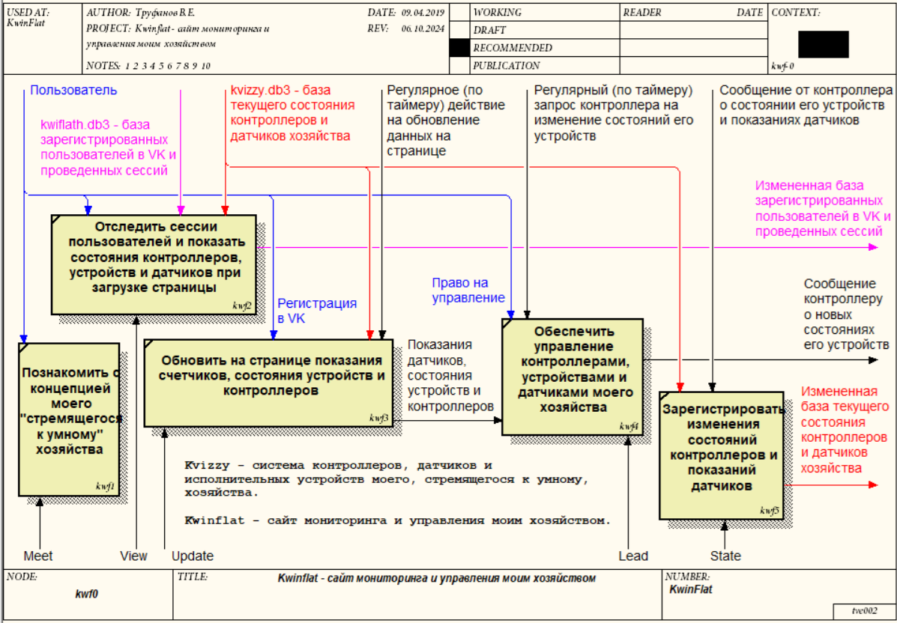
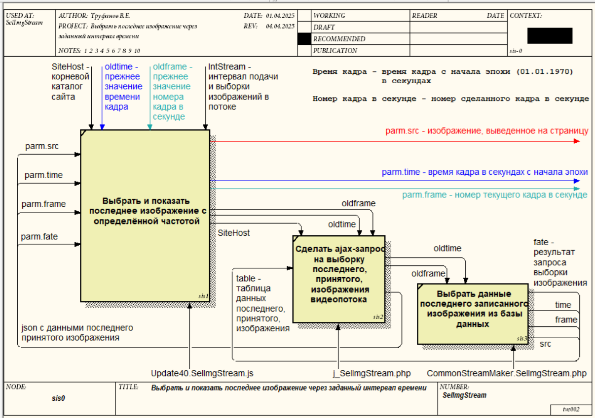

## KwinFlat - близкий всем, сайт умного хозяйства на контроллерах (ESP32-CAM, SIM900)

Сайт [www.kwinflat.ru (https://kwinflat.ru)](https://kwinflat.ru) представляет верхний уровень модели ***умного хозяйства*** на базе контроллеров ESP32-CAM, SIM900.

#### Kwinflat.ru - сайт умного хозяйства.

#### Kvizzy40 - исполнительное приложение умного хозяйства

- ESP32-CAM ***[=DACHA=](#)***, для управления светодиодом, снятия показаний температуры, влажности и формирования потока изображений наблюдаемого объекта;

- SIM900 ***[=NIVA=](#)***, для регистрации GPS-координат автомобиля.



### Структура каталогов.

Система каталогов представлена, как правило, двумя уровнями. Второй уровень - это отдельная страница сайта или набор файлов, объединенных общим назначением.

- ***/*** - корневая страница [***kwinflat.ru*** - ***C:/KwinFlat/www***]  с index.php и iniWorkSpace.php;

- ***/gpx*** - файлы .gpx c путевыми точками, треками и маршрутами GPX-контроллеров;

- ***/Lead*** - страница выявления контроллерами команд управления умным хозяйством;

- ***/Leafgpx*** - карта Leaflet с путевыми точками, треками и маршрутами GPX-контроллеров;

- ***/Leaflet*** - начальная интерактивная карта Leaflet с путешествиями и достопримечательностями;

- ***/Meet*** - начальная страница гостевого пользователя;

- ***/State*** - страница приема и передачи данных в базу, сохранения данных GPS;

- ***/Stream*** - страница регистрации потока изображений;

- ***/Update*** - начальная страница адинистратора.

```
  /View40   - гостевая страница сайта;
```

### Реестр JSON-строк в запросах страниц

#### State

Общий формат запроса:

```
https://probatv.ru/State/?cycle=2&num=-1&ctrl=SIM900&place=NIVA&sjson={"wpt":{"lat":52518611,"lon":13376111}}
```

Реестр JSON-сообщений:

```
{"intrv":{"mode4":7007,"img":1001,"tempvl":3003,"lumin":2002,"bar":5005}}
{"led4":{"light":13,"time":2000}}
{"dht11":{"humi":46,"tempC":248}} 
{"wpt":{"lat":52518611,"lon":13376111}}
```
#### Lead

### v1.0, 2024-09-30

- Страница мониторинга "***View***" и два сервера: "***Lead***" - управления, "***State***" - регистрации изменений состояния умного хозяйства и значений датчиков. Ознакомительная (домашняя) страница - "***Meet***".

- ***View*** - cтраница мониторинга запускается после регистрацию в обществе "VK". Сессии пользователей регистрируются в SQLite3-базе данных ***kwiflath.db3***.

- ***State*** - сервер регистрации изменений состояния доступен лишь контроллерам умного хозяйства. Все изменения регистрируются в SQLite3-базе данных ***kvizzy.db3***.

### v4.4, 2025-03-29

- **Порядок взаимодействия**: 

а) для подключения к системе хозяйства контроллер выполняет пинг сервера и отправляет сообщение серверу ***State*** о своем включении в систему, а также передает сведения о текущем состоянии своих устройств и показания датчиков в JSON-формате; 

б) ***State40*** принимает от контроллера изменения состояния умного хозяйства, значений датчиков и заносит данные в базу kvizzy40.db3; 

в) контроллер регулярно запрашивает команды управления через страницу Lead;

- **Отладка скетчей контроллеров**. Вводятся определения для отладки скетчей контроллеров, по типу:

a) #define debugStackSize 0  // 1 - выполнить контроль размера стека



### v4.5, 2025-06-08

- Режим работы вспышки определяется двумя параметрами: длительностью периода (длительностью цикла "**горит-не горит**") и процентом горения вспышки в периоде (**0% - 100%**).

- Область информации о режиме вспышки делится на 3 части: кнопки управления вспышкой - "ГОРИТ (%)", "НЕТ", "ПЕРИОД (мсек)"; наименование и поля значений режима работы вспышки - "**Led4**", "**10**", "**90**", "**2000**" (по умолчанию); иммитация светодиода вспышки.

- Расцветка информации о режиме вспышки выполняется следующим образом:

а) в начальном состоянии кнопки управления в чёрном цвете, а наименование, поля значений и иммитация светодиода в сером цвете ("вспышка выключена");

б) после смены режима работы вспышки (изменения процента горения или длительности периода) до подтверждения этих данных от контроллера кнопки "ГОРИТ (%)" и "ПЕРИОД (мсек)" в красном цвете; после подтверждения возвращаются в черный цвет;

в) иммитация светодиода мигает, горит постоянно или выключена в соответствии с указанным режимом.

### Библиография

#### [Таймеры Html5+JS](https://thecode.media/count-timer/)

#### [Timers](https://dev.w3.org/html5/spec-LC/timers.html)

#### [Простой таймер](https://sky.pro/wiki/html/sozdaem-taymer-obratnogo-otscheta-na-js-i-html-bez-css/)
