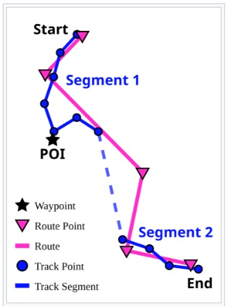
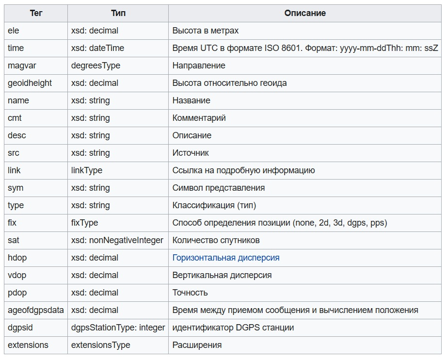

## Файлы GPX

Структура файлов GPX (GPS Exchange Format) основана на элементах XML и включает информацию о путевых точках, маршрутах и треках. Формат позволяет хранить данные GPS, записанные GPS-приёмником, и использовать его для обмена данными между различными программами и устройствами. 

Расширение имени файла	-	***.gpx***

Тип интернет-носителя -			***application/gpx+xml и application/octet-stream***

Первоначальный выпуск -		***2002***

Последняя версия -					***1.1, 9 августа 2004 года***

Веб-сайт - 									***[www.topografix.com/gpx.asp](https://www.topografix.com/gpx.asp)***




#### [GPS Exchange Format](https://en.wikipedia.org/wiki/GPS_Exchange_Format)

- Путевая точка (***wpt***) содержит координаты точки (GPS) в мировой геодезической системе координат ***WGS 84***  и, при необходимости, другую описательную информацию.

Широта и долгота указываются в градусах, высота — в метрах над уровнем моря. Для времени используется стандарт UTC в формате ISO 8601. 

Обозначается тегом ***\<wpt\>***. Описывают отдельную путевую точку, которая по сути является маркером. Координаты задаются атрибутами lat и lon в системе координат WGS 84. Высота может задаваться необязательным тегом ***\<ele\>***.
Точка может содержать и другие теги, например ***\<name\>***.

- Маршрут обозначаются тегом ***\<rte\>*** - это упорядоченный список путевых точек (***rtept***), представляющий собой последовательность важных поворотных точек, ведущих к пункту назначения. Как правило, маршрут используется для описания направления движения, которое кто-то хочет совершить в будущем.

Кроме собственно точек поворота, тег ***\<rtept\>*** может включать имя, описание, комментарий, ссылки и свои собственные элементы из другой схемы. 

- Траектория/трек обозначается тегом ***\<trk\>***. Представляют последовательность точек с отметками времени их прохождения и может состоять из нескольких сегментов ***\<trkseg\>*** (отрезков трек), каждый из которых, в свою очередь, содержит ряд путевых точек, задаваемых тегом ***\<trkpt\>***. Обычно она используется для обозначения уже пройденных или записанных маршрутов. Координаты точек трека задаются аналогично координатам для путевой точки.

- Кроме того, файлы GPX могут содержать метаданные, например, информацию об устройстве и программном обеспечении.

XML-теги, окружающие каждую путевую точку маршрута или сегмента трека, называются ***rtept*** и ***trkpt*** соответственно, а тег для базового элемента путевой точки - ***wpt***. Несмотря на разницу в названиях, все они относятся к одному типу данных - ***wptType***.

Файлы GPX могут содержать дополнительные данные. [***Минимальными свойствами файла GPX являются широта и долгота для каждой отдельной точки.***](#) Некоторые производители, такие как Humminbird и Garmin, используют расширения формата GPX для записи адреса, номера телефона, категории предприятия, температуры воздуха, глубины воды и других параметров.

#### Пример документа GPX

```
<?xml version="1.0" encoding="UTF-8" standalone="no" ?>
<gpx 
  xmlns="http://www.topografix.com/GPX/1/1" version="1.1" creator="Wikipedia"
  xmlns:xsi="http://www.w3.org/2001/XMLSchema-instance"
  xsi:schemaLocation="http://www.topografix.com/GPX/1/1 http://www.topografix.com/GPX/1/1/gpx.xsd"
>

<!-- Comments look like this -->
<metadata>
  <name>Data name</name>
  <desc>Valid GPX example without special characters</desc>
  <author> <name>Author name</name> </author>
</metadata>

<wpt lat="52.518611" lon="13.376111">
  <ele>35.0</ele>
  <time>2011-12-31T23:59:59Z</time>
  <name>Reichstag (Berlin)</name>
  <sym>City</sym>
</wpt>

<wpt lat="48.208031" lon="16.358128">
  <ele>179</ele>
  <time>2011-12-31T23:59:59Z</time>
  <name>Parlament (Wien)</name>
  <sym>City</sym>
</wpt>

<wpt lat="46.9466" lon="7.44412">
  <time>2011-12-31T23:59:59Z</time>
  <name>Bundeshaus (Bern)</name>
  <sym>City</sym>
</wpt>
 
</gpx>
```




### Библиография

#### [gps-wizard](https://logiqx.github.io/gps-wizard/gpx/)

#### [GPX for Developers](https://www.topografix.com/gpx_for_developers.asp)

#### [GPX - OpenStreetMap Wiki](https://wiki.openstreetmap.org/wiki/GPX?ref=wwwy3y3.ghost.io)


